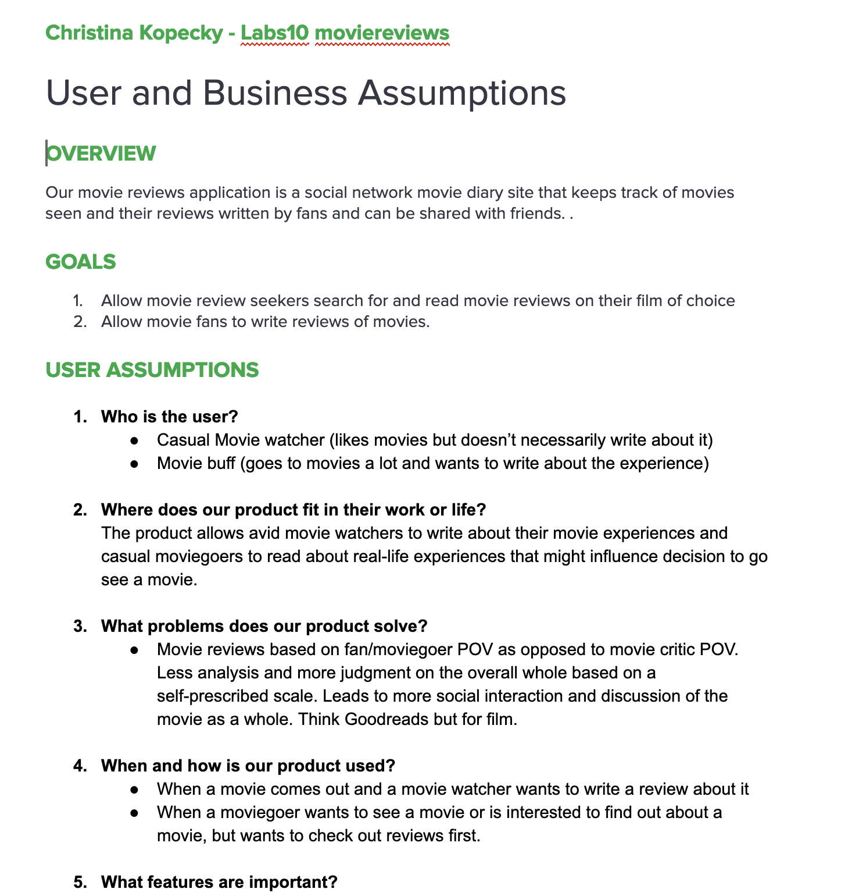
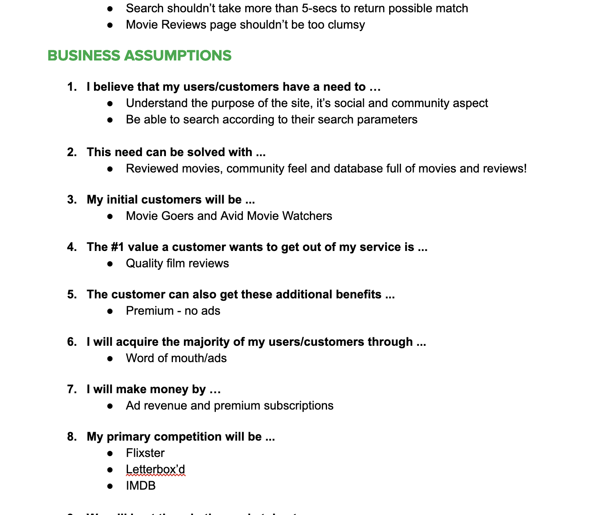
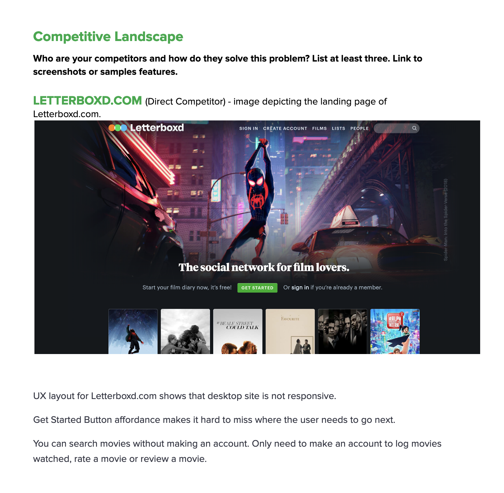
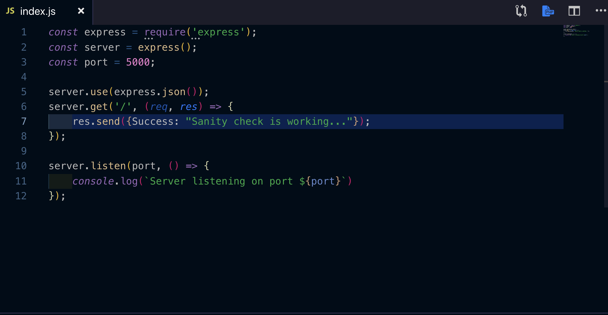
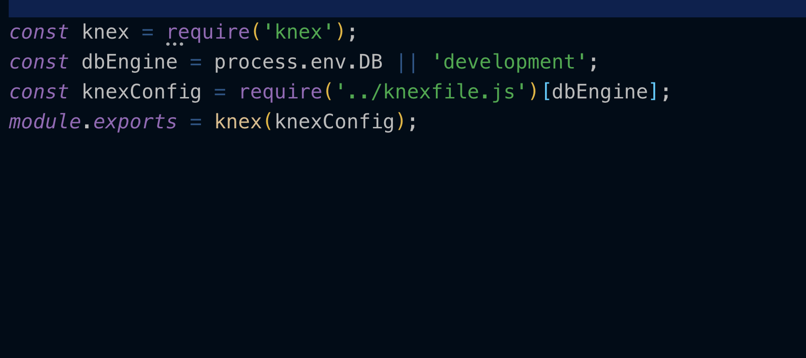
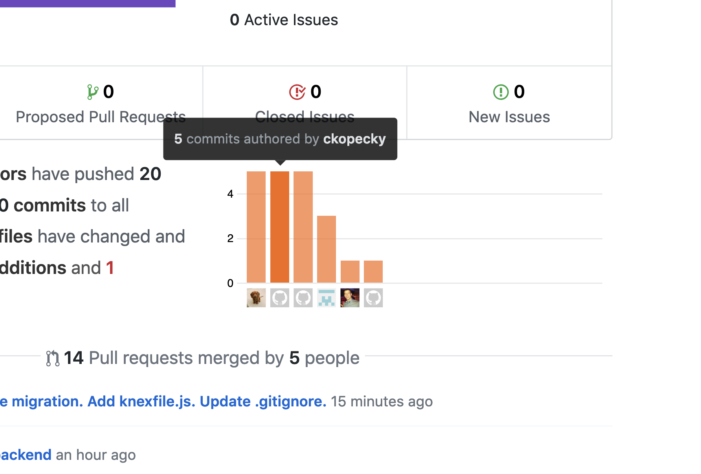

## In the beginning...

I dreamt of this day on Day 1 of Lambda School when I was in lecture with Josh Knell. And here it is! The start of Labs! 

After careful deliberation, I chose to become a member of the moviereviews team. I love movies and I love Goodreads -- which is a platform dedicated to the same type of application, but for books -- so I thought it would be an amazing thing to work on. 

On my team are Dil S., Michelle C., Ari M., and Sam K.. We all come from different levels of web development and I think we will be able to help each other come up with something to be proud of. I can't wait to see what will come of this matching! 

The weekend prior to labs, I did some competitive analysis and user/business assumptions for moviereviews (actual app name to be determined). I was able to draw from what I learned in the UX1 cohort, where I was a PM, and came up with some research that will help in the design of the application. 

Screenshot of work on that translated to work done on Technical Design Document:

It was in the competitive analysis that I discovered the need to not have a paywall detracting customers from viewing reviews. Our potential competition did not have a paywall, so why should moviereviews? 

We made a case to the instructor/stakeholder and it was said that as long as we have some typeof paywall, that it didn't matter how it was structured. We also asked for a definition of __popular__ (defined as the movies with the most reviews written on them in the last 30 days).

As a team we gathered information for the technical design document and then I presented it to the stakeholder on Tuesday afternoon. We were approved and given the repo link to get started on our project! 

Much of Wednesday was spent getting a feel for the gitflow of our group and getting small reps in that we help to solidify how version control is going to work in our group. 

Personally I made only small changes to the structure of the files ([Link to Trello Card and PR](https://trello.com/c/nOLv6Vm5/16-backend-scaffold-basic-setup)), but then I also created a sanity check on the backend while Michelle was constructing the table for the Users. 

It has been tested and it works! 

[Link to Trello Card and PR](https://trello.com/c/cs9XvXfS/20-backend-setting-up-basic-sanity-check)

The team was also able to deploy the front end. 

On Thursday, our team was able to overcome a large hurdle with our deployment to Heroku -- we ran into an issue because Heroku wanted a package.json in the root of our directory - a workaround was found so that Heroku could deploy from a subfolder instead of the root directory. Hooray! 

My involvement was an initial basic config of the database (which was later refactored to look nicer by Sam). The code shown here is code I wrote after knowing not a thing about how to handle knex and sqlite3 for deployment. 

[Link to Trello Card and PR](https://trello.com/c/75Rz1vzX/24-database-config-for-deployment)

My overall review of the week is positive. We all come from different backgrounds and we all come from varying skill levels. We were able to produce a MVP to get us through to the next week. 

In preparing for next week, I will go over Luis' videos on Relational Databases (since all of my database experience is in MongoDB) and take a look at the Passport and Stripe documentation. 

It's a full plate but I am enjoying every minute! 

##### Github contribution as of Wednesday evening: 

### Cheers!

_Christina K._

