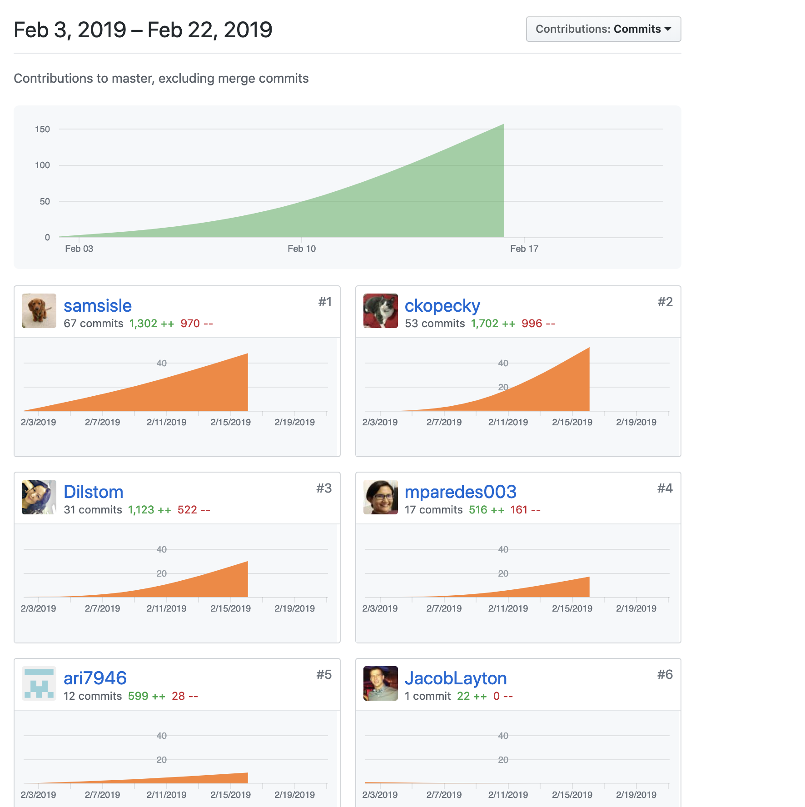
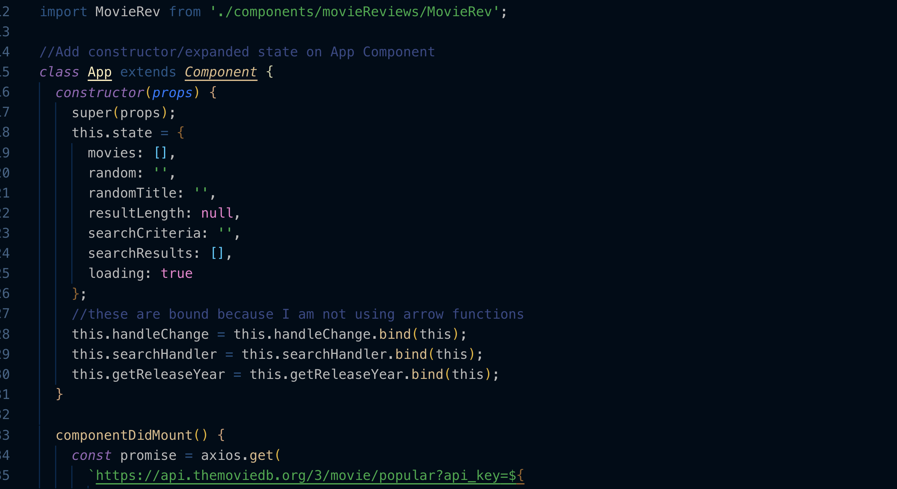

## Individual Accomplishments for the Week

##### Part 1 - Individual Accomplishments this Week

>Paste your team’s github contribution graph here 

>and indicate your Github Handle: 

__ckopecky__

>Provide a paragraph (5-8 sentences) summarizing the work you did this week, the challenges you faced, the tools you used, and your accomplishments.

The week started off with creating backend endpoints so that a user can be created, read, updated and deleted. In addition, endpoints were created for create, read, update and delete a movie review. My involvement was with the PUT and DELETE endpoints of both models using PostgreSQL. 

A challenge I had here was that I came to Lambda School and I learned MongoDB. Just the one week of SQL done back in CS didn't really prepare me for using relational databases -- because of deadlines, I used a teammate's repo from a previous project they did to come up with the endpoints in time. 

I don't feel like I really learned much, but I can at least tell you what the code is doing. I needed the time for a PostgreSQL crash course and that is not something I was able to do. 

On the front end, what was a design for the landing page, became the hero element for the home page. It contains the search logic that taps into the TMDB database and returns search results based on a movie query. 

It only taps into the movie model and does tap into a multi model API where one can search different media-types and people. This is a stretch goal and will not likely be implemented for MVP. 

I also refactored code to direct state management to be at the top of our application so that it's easier to concern ourselves with props. This left the only class component at the time to be the App.js component. All others became presentational components. 

After our teammate left the team, I took the time to redeploy our application on my Netlify Account. 

__Accomplishments?__

Even though it was uncalled for, I have the ability to defend my code if I need to. This will prove great practice for Capstone Defense and I am happy that I got the chance to practice that -- even though the code review was uncalled for when everything worked properly. 

Tasks Pulled
List the tasks you pulled this week, and provide a link to the successfully merged PR completing that task and the trello card for that task.  You must have at least one front end and one back end. The expected total is 6 with a minimum of 4.

[PR Front End #1: Hero Element That Will Eventually Live on Home Page](https://github.com/Lambda-School-Labs/labs10-movie-reviews/pull/48)

>[Trello Ticket #1](https://trello.com/c/rKX69ZIF/31-landing-page)

[PR Front End #2: Refactor code after code review](https://github.com/Lambda-School-Labs/labs10-movie-reviews/pull/56)

>[Trello Ticket #2](https://trello.com/c/rKX69ZIF/31-landing-page)

[PR Front End #3: Merge Hero and Home Page Together](https://github.com/Lambda-School-Labs/labs10-movie-reviews/pull/59)

>[Trello Ticket 3](https://trello.com/c/rKX69ZIF/31-landing-page)

------

[PR Back End #1: UPDATE user](https://github.com/Lambda-School-Labs/labs10-movie-reviews/pull/31)

>[Trello Ticket #1](https://trello.com/c/niLphi9x/41-t-userroutes-put-to-edit-user-info)

[PR Backend #2 : PUT and DELETE reviews](https://github.com/Lambda-School-Labs/labs10-movie-reviews/pull/42/)

>[Trello Ticket #2](https://trello.com/c/UYYIodE6/51-t-reviewsroutes-put-to-edit-a-review)

### Detailed Analysis

>[PR Front End #3: Merge Hero and Home Page Together](https://github.com/Lambda-School-Labs/labs10-movie-reviews/pull/59)

>[Trello Ticket 3](https://trello.com/c/rKX69ZIF/31-landing-page)

This week I worked on search call to the TMDB API in a hero element that ended up as a banner on top of Dil's code on the home page. 

The search input will take any correctly spelled query and return a list of movies that match that query on a new route. In order to get the information to display properly, I created a RegExp function that detected the date in the datetime returned back to us on the API. 

>As you can see in the picture above, matched regex returns the year the movie was released and puts it in the card. 

>An edge case is shown here where the poster_path returns a null image path. Placeholder image is placed with text that says no photo available. 

I moved search query concerns to the trunk of the state tree so that it can be accessed not only on the home page but in the navigation bar as well (to be implemented next week).

With everything that went on this week, I'm happy and proud of what I was able to do. 

##### Part 2 - Milestone Reflections
Put your response to the weekly question and a link to your team journal assignment here.

>Weekly Journal Question: As a part of your journal entry, write ¼ to ½ a page reflecting on your experiences forming a team. What did you do to help the team solidify as a group? What did you do that you now realize caused friction in this process? What are you doing personally to make sure that everyone on the team, including you, has a voice in decision making?

This week was a tough week due to a teammate that didn't really function as part of the team. It has been a very difficult two weeks working with this person, but in the end I do believe that I learned how to defend my code, stick up for myself and tell a higher up when I don't think that something is right about the situation. 

After this team member left, we were able to come back together as a group and put on an amazing presentation for Thursday and communicate in a much better way than we had the entire time the ex-team member was a part of our team. His presence really made a difference in our ability to function as a team -- when his presence went away, it's like we were able to breathe again and come up with a plan of attack for the majority of the rest of next week. 

In our presentation, we were able to provide evidence that the front and back end servers were talking to each other - we had a list of reviews populate the front end after making POST requests on Postman. We also had a dummydata route that provided us with the twitterhandle of the user on the front end. 

[CineView](https://cineview.netlify.com)

If you click on the link right now, you can see a Twitter login in the upper right hand corner.  Twitter auth allows the user to see their reviews. Using the dropdown, we can also logout. 

Test messages added to the database via postman are able to be seen on the front end. 
