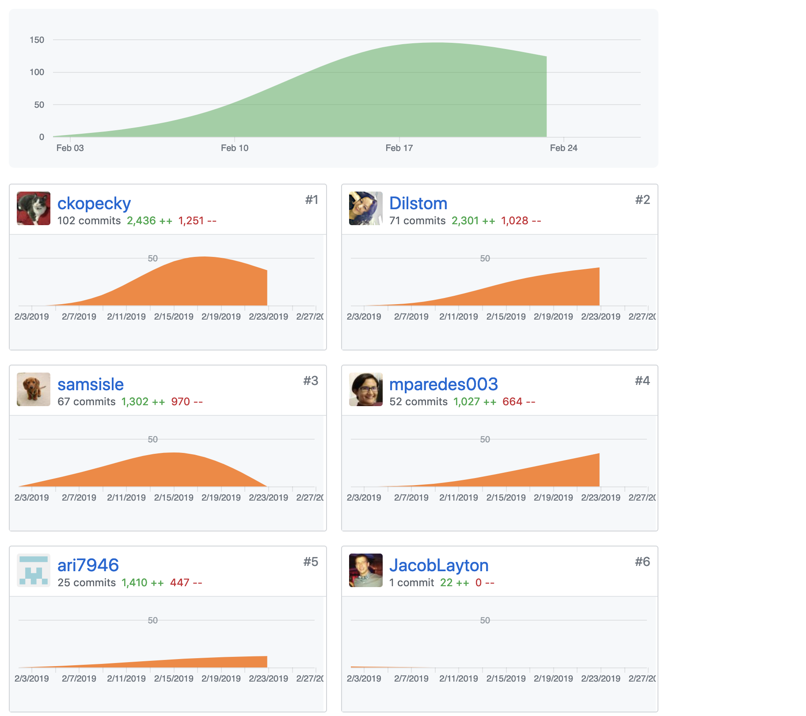
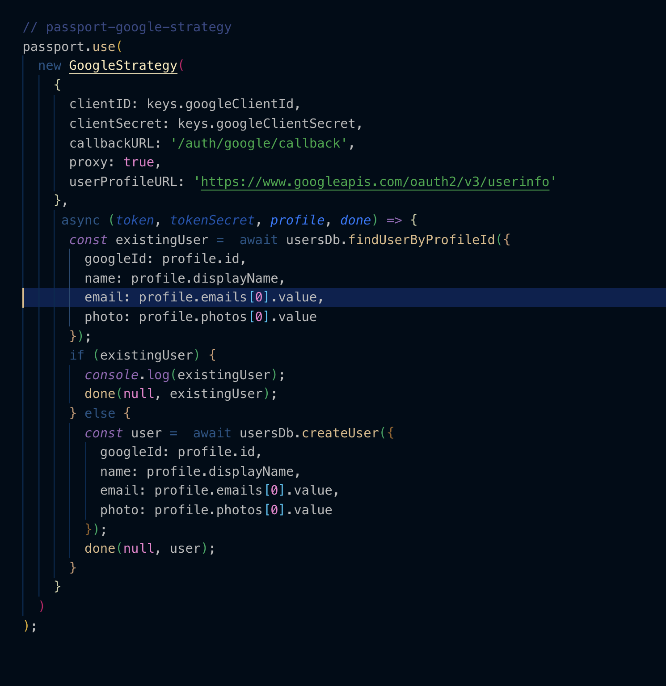
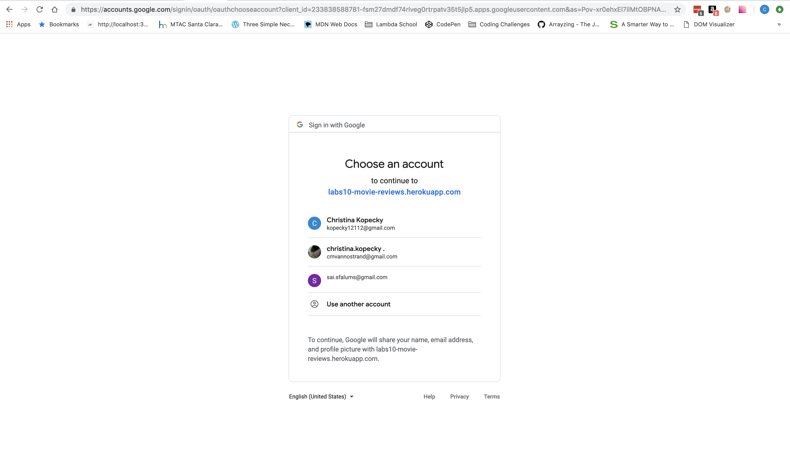
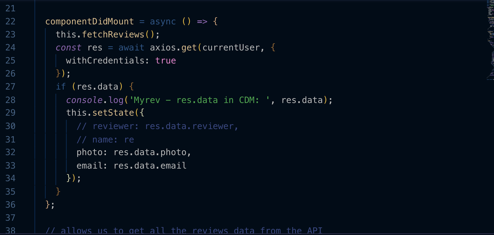

## Individual Accomplishments for the Week

##### Part 1 - Individual Accomplishments this Week

>Paste your team’s github contribution graph here 

>and indicate your Github Handle: 

__ckopecky__

>Provide a paragraph (5-8 sentences) summarizing the work you did this week, the challenges you faced, the tools you used, and your accomplishments.

My main task this week was 0auth after it was decided that Twitter placed too much of a limitation on our user base -- a previous team member made the decision to go with Twitter just to get the 0Auth requirement out of the way and because it was easy - without putting too much thought into the user experience. We decided to change that and implement Google instead. 

With the Passport.JS framework already given to us, it was thought at first it might be pretty simple to implement the Google Strategy. Even though I was assured that their Google Plus API would still work with Passport.JS, I was experiencing some anomalies that I could possibly attribute to the deprecation of the Google Plus API -- weird Google Plus API errors -- that the API was disabled -- even though I had it set up on the Console Developer's Site. 

I implemented a backup plan that included Google's People API -- which needed only one line of additional code to implement. The user profile URL in the strategy itself. This provided the needed functionality to login to the site. 

In addition, I implemented the middleware needed to protect the routes that needed an account to be set up on. Once I understood what _withCredentials_ meant, it was a homerun. I was able to make sure those credentials were present and accounted for and that the user could move on beyond the gate of the protected route. 

That being said, there have been some blunders this week. Utter exhaustion has led to missing little things I would never miss otherwise. Right now there is something going on with our postgresql database on the heroku server and I am just sitting cross-eyed trying to figure out what the error is. 

It's been a heck of a week, but I still love it. It's fun working with a team to accomplish something. 

__Accomplishments?__

I implemented 0Auth with very little (some...but very little once they realized how much I had already done!) help from outside sources. That's something I have __never__ been able to do before. **NEVER**!! :-)

I was also able to write a function that pulled current user data into the front end so that they might get avatar information and other useful info from the Google Object. 

##### Tasks Pulled

List the tasks you pulled this week, and provide a link to the successfully merged PR completing that task and the trello card for that task.  You must have at least one front end and one back end. The expected total is 6 with a minimum of 4.

[PR Front End #1: Footer Element on Home/Landing Page](https://github.com/Lambda-School-Labs/labs10-movie-reviews/pull/66)

>[Trello Ticket #1](https://trello.com/c/a96TPtsA/89-footer-with-home-about-contact-terms-and-privacy-nav-links-contains-legalese-needed-to-use-tmdb)

[PR Front End #2: Add Link to Indiv Search Results Card so it links to its profile page](https://github.com/Lambda-School-Labs/labs10-movie-reviews/pull/90)

>[Trello Ticket #2](https://trello.com/c/hhdSQqX1/116-add-link-from-search-results-to-movie-profile-page-with-reviews)

[PR Front End #3: Add Function to GET Current User Information to Front End](https://github.com/Lambda-School-Labs/labs10-movie-reviews/pull/91)

>[Trello Ticket 3](https://trello.com/c/j17APMJ2/118-add-function-to-grab-user-info-upon-login-to-be-used-in-front-end-middleware-implemented-in-back-end)

------

[PR Back End #1: Google Strategy (both Front and Back End)](https://github.com/Lambda-School-Labs/labs10-movie-reviews/pull/77)

>[Trello Ticket #1](https://trello.com/c/lFN3HZ0K/90-google-oauth)

[PR Backend #2 : Middleware on Backend](https://github.com/Lambda-School-Labs/labs10-movie-reviews/pull/91)

>[Trello Ticket #2](https://trello.com/c/j17APMJ2/118-add-function-to-grab-user-info-upon-login-to-be-used-in-front-end-middleware-implemented-in-back-end)

## Detailed Analysis

This week on worked on a Google Strategy for 0Auth. 0Auth is way for clients to delegate the authentication of some sites they go to third party sites, i.e. Facebook, Google, Github, so that they don't have to use a password for the site. 

As you can see in the next screenshot, if I am to login using the site, I do receive a Google prompt asking which account I would like to use to login with(again - on the deployed site): 

>As you can see in the picture below, we are on the deployed https://cineview.netlify.com site where I have logged in - and you can see that I have logged in because the sign in button is gone and has been replaced with my Google avatar and a dropdown menu of options for the site. 

My task for Thursday was to get the user information pulled into the front end. I was able to do that with the solution below. 

__withCredentials__ is a very powerful phrase that reaches cross origin to get to that backend, look at that cookie and realize that someone is logged in. It then fulfills a promise that returns some data about our user. 

With everything that went on this week, I'm happy and proud of what I was able to do. 

##### Part 2 - Milestone Reflections
Put your response to the weekly question and a link to your team journal assignment here.

>Weekly Journal Question: As a part of your journal entry, write ¼ to ½ a page reflecting on your experiences working with a team to convert a disparate set of components into a single, cohesive, and complete product. Describe the challenges you faced and the steps you took to overcome them.

Our team has faced a unique set of challenges during our time together and I think that has made us closer as a team - especially after the toxic portion of the group went away. I love working in a team to set up an application together. I feel better and not so overwhelmed knowing that I am not entirely responsible for the whole application. This is an appeal of working in a team for me. 

Communication has been key and we've been in constant communication on zoom. I think this has helped us as an overall whole...however I think that can also be a challenge for me personally as well. It's mainly because I have trouble concentrating on what I am supposed to do if I am being interrupted every couple of minutes with a question or a debugging problem. This makes production for me very low. I end up a lot doing the bulk of my work in the evening when I have my thoughts most together and less distractions from the outside world. 

That being said, I do love my team. We all have our weaknesses, but we have our strengths too. I think we'll be great colleagues!

[CineView](https://cineview.netlify.com)

Cheers!

--Christina K.

