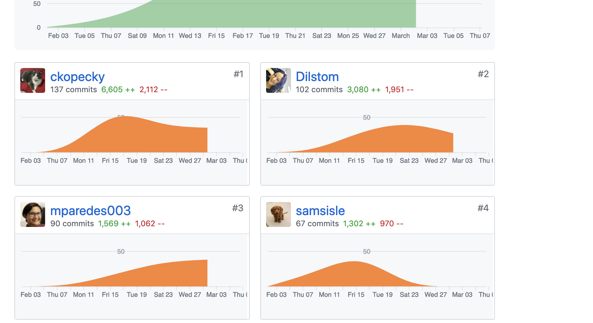
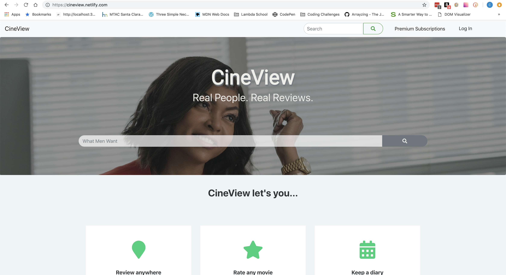
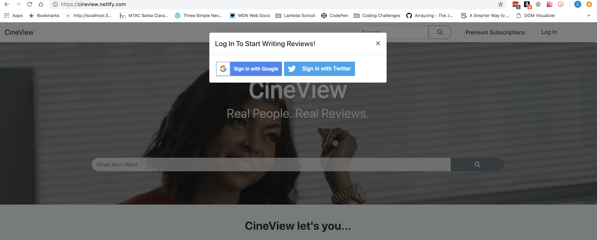
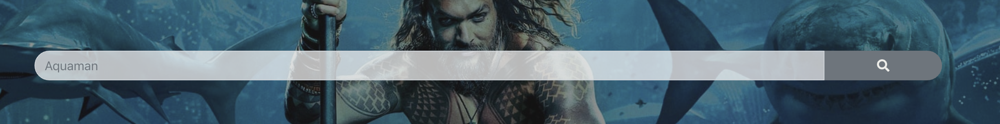
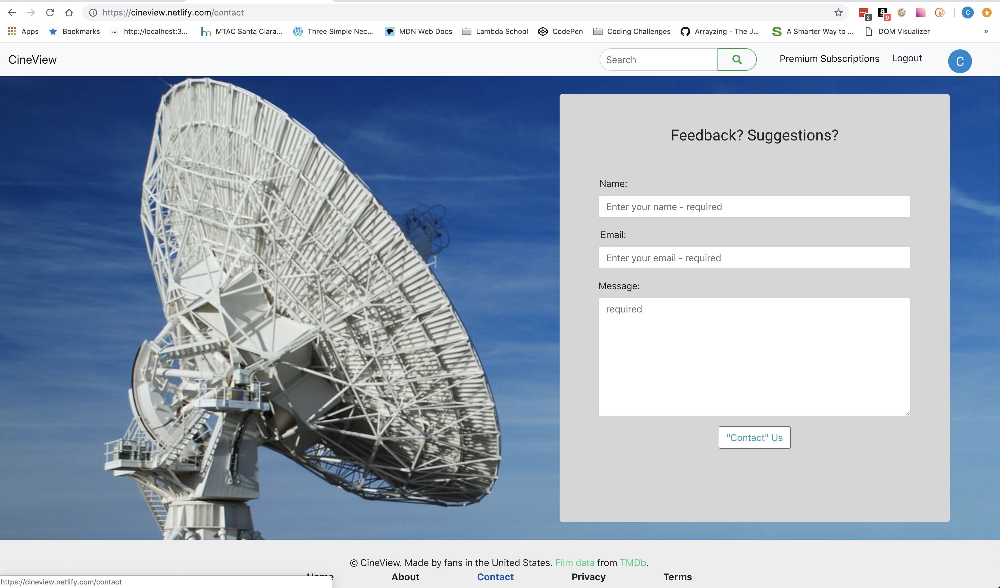

##### Part 1 - Individual Accomplishments this Week

>Paste your team’s github contribution graph here 

>and indicate your Github Handle: 

__ckopecky__

>Provide a paragraph (5-8 sentences) summarizing the work you did this week, the challenges you faced, the tools you used, and your accomplishments.

My main tasks this week were twofold: debug the database since that was crippling out production version of the site and UI/UX of the landing page. 

The database was all-consuming - however! We have data being pulled in, so that's great!

 

In last week's blog, I wrote:

>"Right now there is something going on with our postgresql database on the heroku server and I am just sitting cross-eyed trying to figure out what the error is. 

Nothing truer has been said by myself. It took multiple PMs and an instructor to help us figure out the problem with our database and why it was all wonky, but I think we have the problem sorted out. 

__Accomplishments?__

I was easily able to implement Joshua's suggestions to the UI/UX in the equivalent to a Lambda day - did it overnight on Wednesday night/Thursday morning since I couldn't sleep. The landing page wouldn't have looked as nice at check-in since I spent most of the week debugging and working on the backend if I hadn't taken that time to tackle that problem overnight on Wednesday into Thursday. 

##### Tasks Pulled

List the tasks you pulled this week, and provide a link to the successfully merged PR completing that task and the trello card for that task.  You must have at least one front end and one back end. The expected total is 6 with a minimum of 4.

[PR Front End #1: Restyle Search Results Page](https://github.com/Lambda-School-Labs/labs10-movie-reviews/pull/148)

>[Trello Ticket #1](https://trello.com/c/tK45L1Dq/180-search-ui-edits)

[PR Front End #2: Restyle Search Bar on Landing Page](https://github.com/Lambda-School-Labs/labs10-movie-reviews/pull/155)

>[Trello Ticket #2](https://trello.com/c/tK45L1Dq/180-search-ui-edits)

[PR Front End #3: Finish Contact Form](https://github.com/Lambda-School-Labs/labs10-movie-reviews/pull/153)

>[Trello Ticket 3](https://trello.com/c/bzA4Z0ke/184-finish-contact-form)

------

[PR Back End #1: Re-add Twitter Strategy)](https://github.com/Lambda-School-Labs/labs10-movie-reviews/pull/159)

>[Trello Ticket #1](https://trello.com/c/VnurRDti/188-navigation-bar-revamp)

[PR Backend #2 : Debugging Conditions on Backend](https://github.com/Lambda-School-Labs/labs10-movie-reviews/pull/121)

>[Trello Ticket #2](https://trello.com/c/tvIxvd29/157-t-03-05-fix-deployed-database)

## Detailed Analysis
 
This week was technically UI/UX week, but there was a LOT of time spent troubleshooting the backend due to some sort of fatal error on deploy. As a team, we spent most of the week with PMs and an instructor trying to figure out the problem with our code -- which left very little actual Lambda time to fix UI/UX items on Joshua's list items that needed to be looked at. If we didn't have a database, we couldn't deploy a usable application -- and if we couldn't deploy a usable application, we don't exist. So getting the database fixed was **Priority #1**.  

We've also been having an on-again, off-again issue with the Google Plus API. We will see how it goes from now on, as Google Plus API was deprecated as of yesterday! I hope my fix for using Google People API in Passport-JS works and I don't have to do anything more. If it doesn't, we will have to probably ditch Passport-JS or go with Twitter Strategy only for the purpose of getting this project done on time. 

In terms of UI/UX, I was instrumental in getting the landing page to look the way it does now. The navigation bar was completely redone -- Buying Premium Subscriptions can be accessed without having to log in. 

Log in button is now a modal that when clicked prompts you to log in using Twitter or Google.  

Upon successful login, logout button appears and the user's Google or Twitter avatar appears in navigation bar which is a link to their reviews dashboard. 

The search form was completely redone as well. I completely redid it using reactstrap (same functionality) and replaced the "Search" prompt with an icon from fontawesome. 

To finish out a complete website, I took twenty minutes and fleshed out a "contact" us page. It's nothing big, but I some what amused by the background image...it's the backdrop poster for the movie "Contact". Thought it would be a fun little Easter egg. 

With everything that went on this week, I'm happy and proud of what I was able to do. 

##### Part 2 - Milestone Reflections
Put your response to the weekly question and a link to your team journal assignment here.

>Weekly Journal Question: As a part of your journal entry, write ¼ to ½ a page reflecting on your experiences working with a team to make your product look and feel as good as it works under the hood. Describe how the duties of you and your team shifted tasks shifted towards the front end - and debugging the back end to improve UX.

I honestly don't feel we were given adequate time to make our product look and feel as "good as it works under the hood"...because our backend didn't work under the hood...so we couldn't move on to our front end really...in all honesty. 

We have had a multitude of issues with our backend that took a long time to get help with and our frontend has kind of suffered for it. We have no color scheme. We have no error handling. We won't have a complete product by the end of next week and it actually really disappoints me that I have worked this hard and I don't necessarily have something that I am 100% proud of. 

We lost a developer and we have been doing the work on a project scoped for five developers. It's been super tough to get everything done that we need to get done without working all the time. 

I would love to work for Labs 11, but this is burning me out too much - I just want to go to work and get paid to do it. 

Get me out of here and on to Lambda Next!!! 

[CineView](https://cineview.netlify.com)

*Cheers!*

--Christina K.

