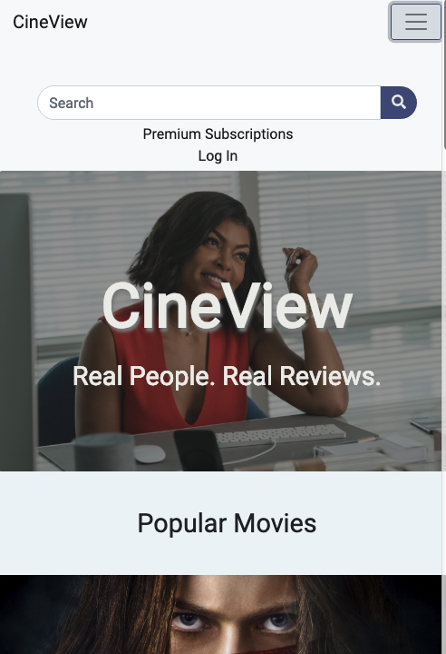

>Paste your team’s github contribution graph here 

>and indicate your Github Handle: 

__ckopecky__

>Provide a paragraph (5-8 sentences) summarizing the work you did this week, the challenges you faced, the tools you used, and your accomplishments.

My main tasks this week were to be sure that the UI/UX was consistent for the navbar, footer, hero and search results. In addition, I spent an entire Lambda day creating the documentation for the README file.  

__Accomplishments?__

I implemented a CSS Reset and set Default values so that font-sizes and button color would remain consistent throughout the application.  We decided on a muted color scheme to let the content speak for itself. I created a codepen to indicate what the default font-sizes, default button and icon colors that were to be used:

The biggest technical accomplishment for me this week was getting the footer to work properly in desktop and mobile views. With no bootstrap implementation here, I used my own custom CSS to create something that hopefully comes across as less busy than the previous implementation. 

I used classes to customize a look for both desktop and mobile views without having to create a whole new component for the mobile view. 

In addition, I spent 8 Lambda Hours on creating the Documentation for the Project. There are still some edits I would like to make, but that was a major accomplishment for me this week:

I also wrote, at the request of the instructors, a description of our application and added it to our 'About' page:

##### Tasks Pulled

List the tasks you pulled this week, and provide a link to the successfully merged PR completing that task and the trello card for that task.  You must have at least one front end and one back end. The expected total is 6 with a minimum of 4.

[PR Front End #1: Restyle Search Results Page](https://github.com/Lambda-School-Labs/labs10-movie-reviews/pull/148)

>[Trello Ticket #1](https://trello.com/c/tK45L1Dq/180-search-ui-edits)

[PR Front End #2: Restyle Search Bar on Landing Page](https://github.com/Lambda-School-Labs/labs10-movie-reviews/pull/155)

>[Trello Ticket #2](https://trello.com/c/tK45L1Dq/180-search-ui-edits)

[PR Front End #3: Finish Contact Form](https://github.com/Lambda-School-Labs/labs10-movie-reviews/pull/153)

>[Trello Ticket 3](https://trello.com/c/bzA4Z0ke/184-finish-contact-form)

[PR Front End #4: Navbar, Footer and Hero Style Adjustments](https://github.com/Lambda-School-Labs/labs10-movie-reviews/pull/180)

>[Navbar Trello Ticket #4](https://trello.com/c/i6WNExMd/221-navbar-style-adjustments)

>[Footer Trello Ticket #4](https://trello.com/c/9mCEmaRY/222-footer-style-adjustments)

>[Hero Trello Ticket #4](https://trello.com/c/SrrGSY0Z/223-hero-style-adjustments)

[PR Front End #5: Mobile Functionality to Footer](https://github.com/Lambda-School-Labs/labs10-movie-reviews/pull/194)

>[Trello Ticket #5](https://trello.com/c/9mCEmaRY/222-footer-style-adjustments)

------

[PR Back End #1: Re-add Twitter Strategy)](https://github.com/Lambda-School-Labs/labs10-movie-reviews/pull/159)

>[Trello Ticket #1](https://trello.com/c/VnurRDti/188-navigation-bar-revamp)

[PR Backend #2 : Debugging Conditions on Backend](https://github.com/Lambda-School-Labs/labs10-movie-reviews/pull/121)

>[Trello Ticket #2](https://trello.com/c/tvIxvd29/157-t-03-05-fix-deployed-database)

[PR Documentation #1](https://github.com/Lambda-School-Labs/labs10-movie-reviews/pull/206)
>[Trello Ticket #1 Documentation](https://trello.com/c/5Z5Tsi2O/22-readme-update)

There is no reflection this week as were are in Flex repeating Week 4 - I added the required PRs and analysis of those PRs.

[CineView](https://cineview.netlify.com)

*Cheers!*

--Christina K.

