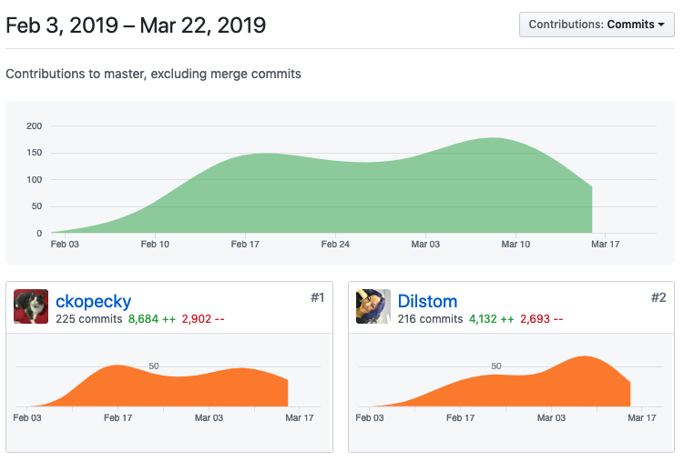
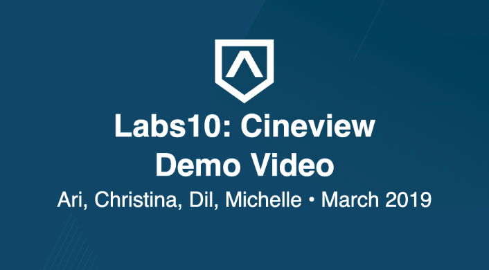
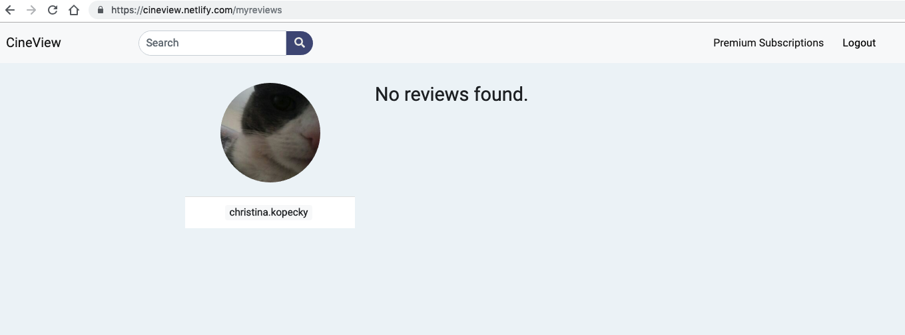
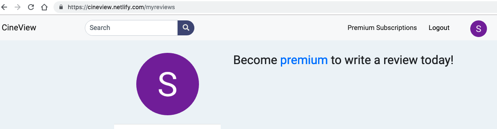
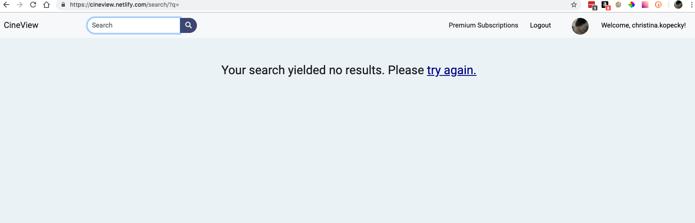
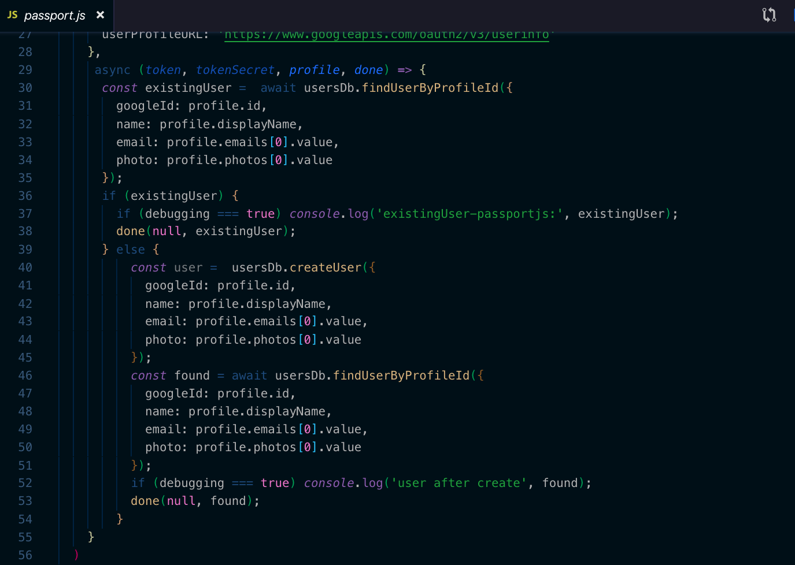
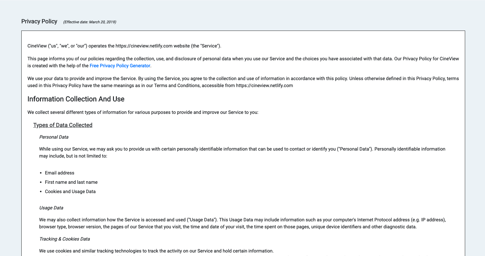
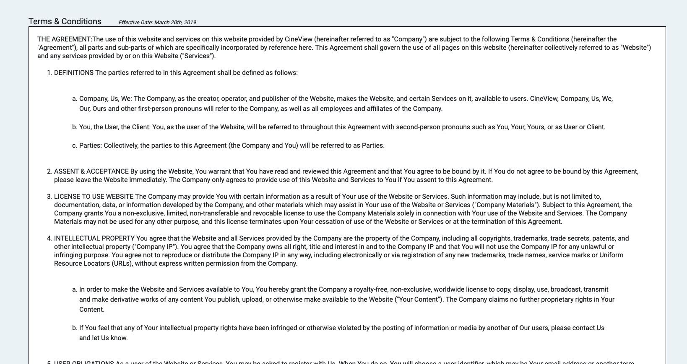

>Paste your team’s github contribution graph here 




>and indicate your Github Handle: 

__ckopecky__

>Provide a paragraph (5-8 sentences) summarizing the work you did this week, the challenges you faced, the tools you used, and your accomplishments.

My main tasks this week were to narrate and demonstrate our movie reviews application in a video so that we can show our application to the world! After Michelle completed some post-processing, I uploaded the video to YouTube so it can be viewed online and created a link to the video from our README.

[](https://youtu.be/Yz7zt-JNJu8)
[Link to Project README](https://github.com/Lambda-School-Labs/labs10-movie-reviews/blob/master/README.md)

In addition, I added some error handling if a premium user and a standard user has an empty reviews array. If a user is premium, it says that there are no reviews. If they are standard, it prompts the user to sign up for a premium account so that they can start writing reviews. I also added error handling if a search result query turns up empty array.








__Accomplishments?__

I implemented a bit of a fix for the problem that stemmed from a new user logging into the site for the first time - this was my biggest technical accomplishment for the week:




Prior to this week, the Google Strategy just created the user but did not go back into the database to find the user. I added a condition that allowed for that to happen. I tested it extensively on our local site, but the fix does not seem to translate to our deployed site. It was a bit of an accomplishment but a bit of a drawback as well as I cannot for the life of me figure out what's going on the deployed site to not make my fix work. I do not have enough experience to spot if something is wrong and I need some assistance to make it work. 

To make our appplication more complete as well, I took the time to generate and markup a [Terms and Conditions](https://cineview.netlify.com/terms) page as well as a [Privacy Policy](https://cineview.netlify.com/privacy) page. 





##### Tasks Pulled

List the tasks you pulled this week, and provide a link to the successfully merged PR completing that task and the trello card for that task.  You must have at least one front end and one back end. The expected total is 6 with a minimum of 4.

[PR Front End #1: Style Fixes to Buttons](https://github.com/Lambda-School-Labs/labs10-movie-reviews/pull/254)

>[Trello Ticket #1](https://trello.com/c/kBrgPpnY/282-double-check-links-on-buttons-make-sure-the-whole-button-is-link-and-not-just-the-content-inside-button)

[PR Front End #2: Terms and Conditions](https://github.com/Lambda-School-Labs/labs10-movie-reviews/pull/248)

>[Trello Ticket #2](https://trello.com/c/Q0BENuhk/270-terms-and-conditions)

[PR Front End #3: Bug Fix where long components don't auto scroll back to top](https://github.com/Lambda-School-Labs/labs10-movie-reviews/pull/241)

>[Trello Ticket 3](https://trello.com/c/7soCpGZe/266-when-changing-route-paths-on-long-components-page-does-not-scroll-back-to-top)

[PR Front End #4: Privacy Policy](https://github.com/Lambda-School-Labs/labs10-movie-reviews/pull/244)

>[Trello Ticket #4](https://trello.com/c/JavAH3nz/269-privacy-policy)

[PR Front End #5: Bug Fix that did not allow Search on KeyUp](https://github.com/Lambda-School-Labs/labs10-movie-reviews/pull/255)

>[Trello Ticket #5](https://trello.com/c/kBrgPpnY/282-double-check-links-on-buttons-make-sure-the-whole-button-is-link-and-not-just-the-content-inside-button)

[PR Front End #6: Feature List Refactor to Fix Responsiveness](https://github.com/Lambda-School-Labs/labs10-movie-reviews/pull/237)
>[Trello Ticket #6](https://trello.com/c/YUJWlaAw/263-feature-list-refactor-to-fix-reponsiveness-issue)
------

[PR Back End #1: Add Fix to Google Strategy (works on local, but not deployed))](https://github.com/Lambda-School-Labs/labs10-movie-reviews/pull/233)

>[Trello Ticket #1](https://trello.com/c/M6PBMAub/211-current-debug-if-time-new-user-login-doesnt-register-properly-doesnt-register-the-login-first-but-if-i-log-in-again-with-same-ac)


[PR Back End #2: Header Error on log in](https://github.com/Lambda-School-Labs/labs10-movie-reviews/pull/214)
>[Trello Ticket #2](https://trello.com/c/mFXiqFuO/247-header-error-long-error-when-log-in)


[PR Documentation #1](https://github.com/Lambda-School-Labs/labs10-movie-reviews/pull/238)
[PR Documentation #2](https://github.com/Lambda-School-Labs/labs10-movie-reviews/wiki)
>[Trello Ticket #1 Documentation](https://trello.com/c/b4kWv1Zc/264-edit-readme)
>[Trello Ticket #2 Documentation](https://trello.com/c/tP5FG9yB/259-video-narration-and-recording)

Part 2 - Weekly Reflection: 

```
as part of your journal entry, write an essay on 
your experiences working with a team to bring an 
application to completion. Describe some of the 
final tasks that were the most difficult for 
your team to resolve - challenging bugs, layout 
and presentation woes, or anything else that was 
easy to mostly get working, but hard to get perfect.
```

One of the things I have learned here while at Lambda School, is that a project is never complete - you can only complete it _just enough_ - and it will never be perfect. I love our application and I love what we were able to put it together with the team we had in such a short amount of time. 

The most challenging bug is still one that is not solved, and I'm not sure it will be solved unless the authentication is completely revamped. The frustrating thing for me was that I couldn't get help on solving it - my teammates didn't know how to solve it, and trying to get help was a problem. So it was left unresolved. 

Another obstacle for me this week was preparing a script and a user journey that would work around presentational bugs that the application had at the time. Doing the video in one long take is super difficult to do and I am proud that I was able to accomplish that goal. I am not a videographer nor a professional filmmaker and what was put together I think was really great! 

I think one of the things that we ran into this week was how much all of us have pushed ourselves and how much we are ready to be "done for now" on this application. I think what we have produced is really great, but I am ready to move on to the next phase to find a job! 

[CineView](https://cineview.netlify.com)


*Allons-y!!*

--Christina K.

